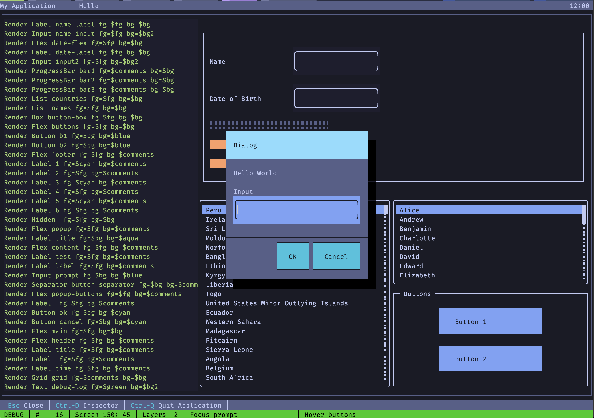
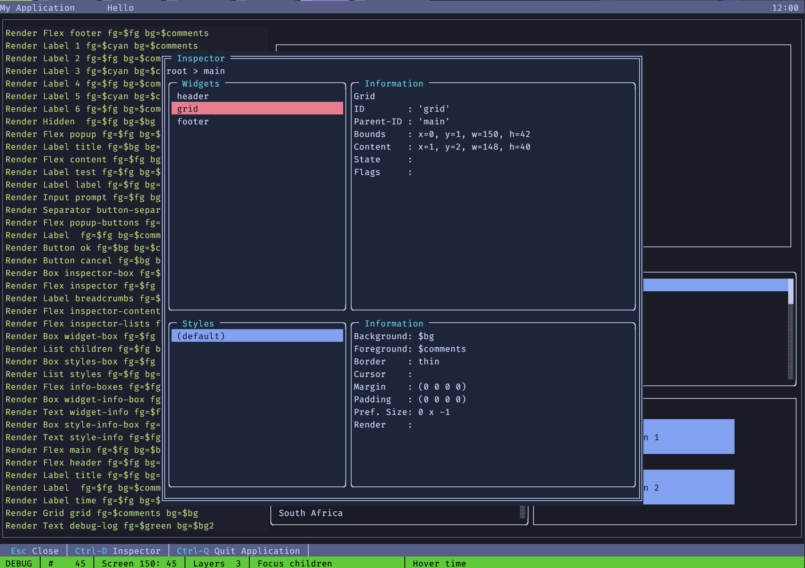

# zeichenwerk

Zeichenwerk (german for *character works*) is a console UI library, which
aims to be an easy to use, yet modern UI library for console applications
in Go.

> [!WARNING]
> This is WORK IN PROGRESS!
> I am working heavily on it at the moment and will change names, interfaces,
> method and function signatures. Feel free to participate or make better
> suggestions!

## Goals

My main goal was to have an easy to use library for small, interactive tools.
I am a child of the 80s, so my first real programming encounters were with
MS-DOS and a screen with 80x25 characters, writing to screen buffers and
having a poster with the ASCII codes in the wall in front of me. Sometimes
I still miss the productivity I had these days with programming languages
likes Clipper.

Lately I found beautiful console applications like lazygit, lazydocker,
neovim, yazi, goful and others. Also finding Nerd Fonts and good terminal
applications like kitty or Ghostty inspired me to use the terminal more
often and get rid of the mouse or touchpad.

This library is the basis for small tools, I will write for me and probably
never publish. Probably will. Don't know yet. I have ideas, e.g. integrate
a console UI into a Go Web Application as a Dashboard with statistics, logs,
etc. directly on the console.

Probably this library will inspire others to use it or even participate in
its development. There are still a lot of things missing and a lot of things
I am not really satisfied with. The included demo and its included inspector
are the first application I have written with it so far.

## How does it look

## Features

The TUI package offers a complete toolkit for creating professional terminal
applications with modern UI patterns. It provides a widget-based architecture
with container layouts, event-driven programming, and extensive customization
options through themes and styling.

### Widgets

The package includes a rich set of built-in widgets for common UI patterns:

- Input: Single-line text input with editing capabilities, password masking,
  and validation
- Label: Static text display with alignment options
- Button: Interactive buttons with click handlers and styling
- List: Scrollable item lists with multi-selection and keyboard navigation
- Text: Multi-line text display with scrolling and content management
- ProgressBar: Visual progress indicators with customizable styling
- Viewport: Scrollable content containers for large data sets

### Containers

Layout containers organize widgets into structured interfaces:

- Box: Simple single-widget container with borders and padding
- Flex: Flexible layouts with horizontal/vertical orientation and dynamic sizing
- Grid: Precise grid-based layouts with cell positioning and spanning
- Stack: Layered widget management for overlays and modal dialogs

### Event System

A robust event-driven architecture enables responsive user interactions:

- Widget-specific events (change, focus, select, activate)
- Raw keyboard and mouse event handling
- Event propagation and consumption model
- Custom event registration and emission

### Styling and Theming

Comprehensive visual customization through themes and styles:

- Built-in themes (Default, Tokyo Night) with consistent color schemes
- CSS-like styling system with classes and inheritance
- Border styles and decorative elements
- Color management with terminal compatibility
- Dynamic theme switching and custom theme creation

## Documentation

> [!WARNING]
> AI helped me to write large parts of the documentation, so the documentation
> might contain errors, misunderstandings or outdated information. I changed
> a lot of things even without updating everything.

Look at the doc.go for package documentation and some AI generated bullshit
advertising and buzzwords. Also the demo.go is a good starting place.

## Tutorial

There is a small AI generated and probably not really correct tutorial in [[TUTORIAL.md]]

> [!TIP]
> Do not use `zeichenwerk` as the package name, when importing it. Take something
> shorter like `tui` or even`.`, although it is not recommended. But when separating
> the UI from the rest, your Go code will be better readable with the`.`

## Development Principles

There are some principles I follow during development. I want to keep the code
clean, short and concise.

- Keep the widget creation, widget state and rendering separate.
- Short and concise names, avoid CamelCase, Get... and make use of the context
  for understanding what something is or does.
- Locality of behaviour to better understand something.
- Fluent API for building the UI in code.
- Use strings instead of constants for widgets.
- Use numbers with meaning, where possible (e.g. negative values for fractions,
  0 for auto)

## Next steps

In no particular order!

- [ ] Change theme at build time and runtime (tokyo midnight is hard coded)
- [ ] Review existing mostly AI generated documentation
- [ ] Extend the demo to all current widgets with dedicated pages for the
      individual widgets
- [ ] Implement Scroller widget
- [ ] Implement Switcher widget
- [ ] Add auto height and width (0) to grid
- [ ] Add Tabs widget
- [ ] Add Table Widget
- [ ] Add proper form handling for large forms with many fields (Form widget or
  builder with helpers)
- [ ] Improve internal logging with proper error handling, source widget
      (will break existing w.Log)
- [ ] Extend inspector to show widget-specific information
- [ ] Add style manipulation to the inspector
- [ ] Improve theming
- [ ] Add a nord inspired theme
- [ ] Add a gruvbox inspired theme
- [ ] Add a midnight neon theme
- [ ] Improve theme variables and make them visible in the inspector

## Ideas

- Add a designer to create and manipulate the UI
- Add a builder, which reads in a file with UI specification (yaml, toml, ...)
- Add Go builder code generation to the designer

## Things I will probably build with it

- HAL Explorer for Web APIs
- Web Server Dashboard
- Color conversion utility
- Date algorithm playground
- Simple programming environment for kids & learning
- Add easter eggs like snake or tetris

## All the rest

This is a free-time project and you may use it under the MIT license, copy it,
fork it, etc.

> [!HINT]
> Please insert coin if you want me to spend more of my spare time on this
> or have specific feature requests.
