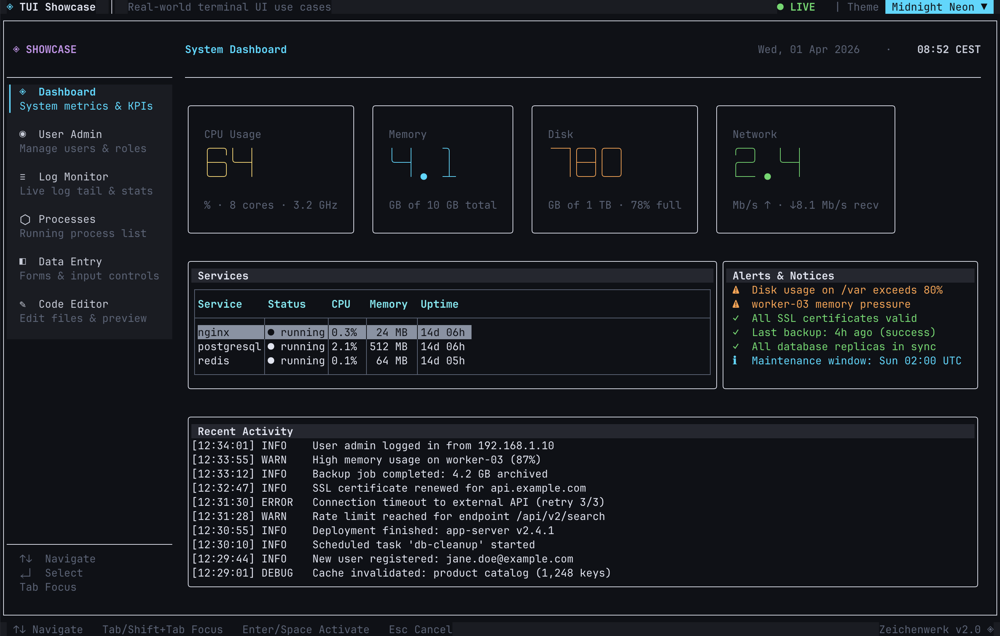

# zeichenwerk


Zeichenwerk (German for "character works") is a modern, idiomatic Go library for
building terminal user interfaces. It features a fluent builder API, a
functional composition API, and an enhanced widget system.

## How it looks



## Quick Example

```go
package main

import . "github.com/tekugo/zeichenwerk"

func main() {
    NewBuilder(TokyoNightTheme()).
        Flex("main", false, "stretch", 0).
            Flex("header", true, "center", 1).
                Static("title", "My App").
            End().
            Grid("content", 2, 2, false).Columns(20, -1).
                Cell(0, 0, 1, 1).List("menu", "Item 1", "Item 2", "Item 3").
                Cell(1, 0, 1, 1).Button("action", "Click Me").
            End().
        End().
        Run()
}
```

## Composition API

The `compose` sub-package offers a functional alternative to the builder. Each
widget is an `Option` — a plain function — that you nest directly:

```go
package main

import (
    z "github.com/tekugo/zeichenwerk"
    . "github.com/tekugo/zeichenwerk/compose"
)

func main() {
    UI(z.TokyoNightTheme(),
        Flex("main", "", false, "stretch", 0,
            Flex("header", "", true, "center", 1,
                Static("title", "", "My App"),
            ),
            Grid("content", "", []int{0}, []int{20, -1}, false,
                Cell(0, 0, 1, 1, List("menu", "", []string{"Item 1", "Item 2", "Item 3"})),
                Cell(1, 0, 1, 1, Button("action", "", "Click Me")),
            ),
        ),
    ).Run()
}
```

Screens can be split into separate functions and composed with `Include`:

```go
UI(z.TokyoNightTheme(),
    Flex("root", "", false, "stretch", 0,
        Include(header),
        Include(content),
        Include(footer),
    ),
).Run()

func header(theme *z.Theme) z.Widget {
    return Build(theme, Static("title", "", "My App", Font("bold"), Fg("$cyan")))
}
```

Where direct widget access is needed after construction — for example to wire
events, populate a tree, or start animations — retrieve the widget imperatively
with `z.Find` and call methods on it directly.

## Why zeichenwerk

Zeichenwerk is designed for developers who want:

- A fluent, chainable builder API or a functional composition API
- Higher-level widgets than tcell
- More composable layouts than tview
- A traditional retained widget hierarchy rather than an event/message
  architecture

Compare to other Go TUI libraries:

| Library     | Style                               |
| ----------- | ----------------------------------- |
| tcell       | Low-level terminal primitives       |
| tview       | Traditional widget toolkit          |
| bubbletea   | Elm-style update loop               |
| zeichenwerk | Builder + functional composition    |

## Installation

```bash
go get github.com/tekugo/zeichenwerk
```

## Widgets

| Category    | Widgets                               |
| ----------- | ------------------------------------- |
| Containers  | Box, Flex, Grid, Form, Switcher, Tabs |
| Interaction | Button, Checkbox, Input, Select       |
| Display     | Collapsible, Deck, List, Table        |
| Overlay     | Dialog + Containers                   |
| Animation   | Animation, Grow, Scanner, Spinner     |

Also includes:

- Multi-line text editor/area
- Inspector for introspection and debugging
- Included structured logging
- Canvas, which will be used for a TUI designer
- Forms created from and bound to Go structs
- Styled text display with inline markup and word wrapping

## Features

### Event System

```go
button.On("click", func(w Widget, event string, data ...any) bool {
    // Handle click
    return true
})
```

### Styling & Themes

```go
theme := NewTheme()
theme.Set("button.primary", NewStyle("blue", "white", ""))
theme.Set("button#submit", NewStyle("green", "black", "bold"))
```

Built-in themes:

- `TokyoNightTheme()` - Dark theme with purple/blue accents
- more to follow

### Focus Navigation

- Tab/Shift+Tab: Move focus between widgets
- Arrow keys: Navigate within widgets (lists, tables)
- Enter/Space: Activate buttons, toggle checkboxes

### Mouse Support

- Click to focus widgets
- Hover states with visual feedback

## Architecture

```
UI (root)
├── Component (embedded)
│   ├── Bounds (x, y, width, height)
│   ├── Styles (CSS-like selectors)
│   ├── Events (handlers, bubbling)
│   └── Parent/Child hierarchy
├── Layers (popups/modals)
├── Event Loop (tcell integration)
├── Renderer (dirty-flag optimizations)
└── Focus Manager
```

## Demo

Explore the showcase for examples of all widgets using the builder API:

```bash
go run ./cmd/showcase
```

Or the same showcase rewritten with the composition API:

```bash
go run ./cmd/compose
```

## Documentation

- **Tutorial (start here):** [doc/tutorial.md](doc/tutorial.md)
- Package docs: [doc.go](doc.go)
- Widget reference: [doc/reference/overview.md](doc/reference/overview.md)
- Builder pattern: [builder.go](builder.go)
- Composition API: [compose/compose.go](compose/compose.go)
- Theme system: [theme.go](theme.go)
- Component base: [component.go](component.go)

## Development Status

**Active development** - Core features are implemented. Widget interface is
stable. Widget-level test coverage and some layout edge cases are still being
worked on.

## AI Assistance

This project was developed with the support of AI coding assistants —
specifically Claude (Anthropic), StepFun-3.5-Flash, and Qwen-3.5 — for coding
support, documentation drafting, and test creation.

That said, all code was reviewed, tested, fine-tuned, and adjusted by me, and
all significant design decisions were made by me. AI assistants are well-trained
on GUI and web development patterns, but terminal UI is a niche where their
experience is limited. The retained widget hierarchy, layout engine, scroll
regions, ANSI terminal emulation, and theme system required substantial manual
coding, debugging, and iteration that went well beyond what any assistant
produced out of the box.

At the same time, without the heavy lifting in coding, specification work, and
documentation that AI agents made possible, a spare-time project of this scope
simply would not be feasible for a single developer.

## License

MIT © Thomas Rustemeyer
