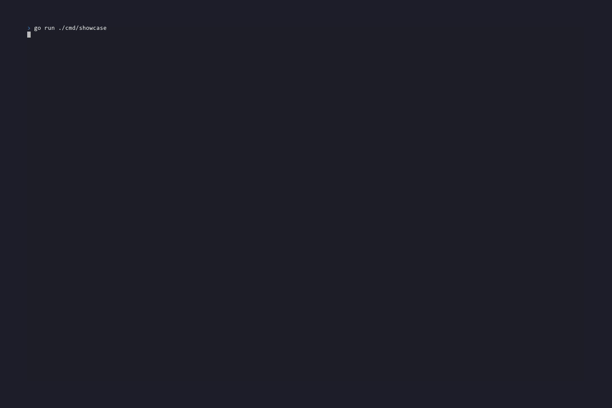

# zeichenwerk


Zeichenwerk (German for "character works") is a modern, idiomatic Go library for
building terminal user interfaces. It features a fluent builder API, a
functional composition API, and an enhanced widget system.

> Developed with and for AI coding assistants — see
> [AI Assistance](#ai-assistance) for details.

## How it looks



## Quick Example

```go
package main

import (
    . "github.com/tekugo/zeichenwerk/v2"
    "github.com/tekugo/zeichenwerk/v2/core"
    "github.com/tekugo/zeichenwerk/v2/themes"
)

func main() {
    NewBuilder(themes.TokyoNight()).
        VFlex("main", core.Stretch, 0).
            HFlex("header", core.Center, 1).Hint(0, 1).
                Static("title", "My App").Font("bold").Foreground("$cyan").
            End().
            Grid("content", 1, 2, false).Columns(20, -1).Rows(-1).Hint(0, -1).
                Cell(0, 0, 1, 1).List("menu", "Item 1", "Item 2", "Item 3").
                Cell(1, 0, 1, 1).Button("action", "Click Me").
            End().
        End().
        Run()
}
```

Press `q` or `Ctrl-Q` to quit.

## Composition API

The `compose` sub-package offers a functional alternative to the builder. Each
widget is an `Option` — a plain function — that you nest directly:

```go
package main

import (
    "github.com/tekugo/zeichenwerk/v2/core"
    . "github.com/tekugo/zeichenwerk/v2/compose"
    "github.com/tekugo/zeichenwerk/v2/themes"
)

func main() {
    UI(themes.TokyoNight(),
        VFlex("main", "", core.Stretch, 0,
            HFlex("header", "", core.Center, 1,
                Static("title", "", "My App", Font("bold"), Fg("$cyan")),
            ),
            Grid("content", "", []int{-1}, []int{20, -1}, false, Hint(0, -1),
                Cell(0, 0, 1, 1, List("menu", "", []string{"Item 1", "Item 2", "Item 3"})),
                Cell(1, 0, 1, 1, Button("action", "", "Click Me")),
            ),
        ),
    ).Run()
}
```

Screens can be split into separate functions and composed with `Include`:

```go
UI(themes.TokyoNight(),
    VFlex("root", "", core.Stretch, 0,
        Include(header),
        Include(content),
        Include(footer),
    ),
).Run()

func header(theme *core.Theme) core.Widget {
    return Build(theme, Static("title", "", "My App", Font("bold"), Fg("$cyan")))
}
```

Where direct widget access is needed after construction — for example to wire
events, populate a tree, or start animations — retrieve the widget imperatively
with `core.Find` (or the typed `core.MustFind[T]`) and call methods on it
directly.

## Why zeichenwerk

Zeichenwerk is designed for developers who want:

- A fluent, chainable builder API or a functional composition API
- Higher-level widgets than tcell
- More composable layouts than tview
- A traditional retained widget hierarchy rather than an event/message
  architecture

Compare to other Go TUI libraries:

| Library     | Style                            |
| ----------- | -------------------------------- |
| tcell       | Low-level terminal primitives    |
| tview       | Traditional widget toolkit       |
| bubbletea   | Elm-style update loop            |
| zeichenwerk | Builder + functional composition |

## Installation

```bash
go get github.com/tekugo/zeichenwerk/v2
```

## Widgets

| Category   | Widgets                                                                                                                             |
| ---------- | ----------------------------------------------------------------------------------------------------------------------------------- |
| Containers | Box, Card, Collapsible, CRT, Dialog, Flex, Form, FormGroup, Grid, Grow, Switcher, Tabs, Viewport                                    |
| Input      | Button, Checkbox, Combo, Editor, Filter, Input, List, Select, Tree, TreeFS, Typeahead                                               |
| Display    | BarChart, Breadcrumb, Canvas, Deck, Digits, Heatmap, Rule, Shortcuts, Sparkline, Static, Styled, Table, Tabs, Terminal, Text, Tiles |
| Animated   | Clock, Marquee, Progress, Scanner, Shimmer, Spinner, Typewriter                                                                     |
| Overlay    | Commands palette, Dialog, and container-based popups                                                                                |

## Features

### Event System

Each widget dispatches events; handlers run in reverse registration order and
bubble up through parent containers until one returns `true`:

```go
button := core.MustFind[*widgets.Button](ui, "submit")

// Typed helper — unwraps the int payload for you.
widgets.OnActivate(button, func(idx int) bool {
    // handle click
    return true
})

// Raw form when the data type isn't string/int (e.g. Checkbox sends bool).
checkbox.On(widgets.EvtChange, func(_ Widget, _ Event, data ...any) bool {
    checked := data[0].(bool)
    _ = checked
    return true
})
```

See [`doc/events.md`](doc/events.md) for the full event list and per-widget
payload table.

### Styling & Themes

Built-in themes (in the `themes` sub-package):

- `themes.TokyoNight()` — dark, blue/purple accents
- `themes.GruvboxDark()` / `themes.GruvboxLight()` — retro warm palette
- `themes.Nord()` — arctic blue-grey
- `themes.MidnightNeon()` — near-black with electric cyan/magenta
- `themes.Lipstick()` — Charm-inspired fuchsia and indigo

Each theme registers a colour palette (`$bg0`, `$fg0`, `$cyan`, …) plus default
styles for every built-in widget. Per-widget overrides chain on the builder:

```go
Static("title", "Dashboard").
    Foreground("$cyan").
    Background("$bg1").
    Font("bold").
    Padding(0, 2)

Button("ok", "Confirm").
    Background("$bg2").                // default state
    Background(":focus", "$blue").     // when focused
    Foreground(":focus", "$bg0")
```

Custom themes can be assembled from `core.NewTheme()` and styled by selector
(`type.class#id:state`); see [`themes/tokyo-night.go`](themes/tokyo-night.go)
for a minimal worked example.

### Focus Navigation

- Tab/Shift+Tab: Move focus between widgets
- Arrow keys: Navigate within widgets (lists, tables)
- Enter/Space: Activate buttons, toggle checkboxes

### Mouse Support

- Click to focus widgets
- Hover states with visual feedback

## Architecture

```
UI (root)
├── Component (embedded)
│   ├── Bounds (x, y, width, height)
│   ├── Styles (CSS-like selectors)
│   ├── Events (handlers, bubbling)
│   └── Parent/Child hierarchy
├── Layers (popups/modals)
├── Event Loop (tcell integration)
├── Renderer (dirty-flag optimizations)
└── Focus Manager
```

## Demo

Explore all widgets interactively with the builder-API demo:

```bash
go run ./cmd/demo
```

Or the composition-API showcase:

```bash
go run ./cmd/compose
```

## Documentation

- **Tutorial (start here):** [doc/tutorial/README.md](doc/tutorial/README.md)
- Package docs: [doc.go](doc.go)
- Widget reference: [doc/reference/overview.md](doc/reference/overview.md)
- Builder pattern: [builder.go](builder.go)
- Composition API: [compose/compose.go](compose/compose.go)
- Theme system: [theme.go](theme.go)
- Component base: [component.go](component.go)

## Agentic-ready

Zeichenwerk ships with first-class support for AI agents and automated tooling
that need to observe or interact with a running UI without a live terminal.

### Widget hierarchy dump

`Dump(w io.Writer, root Widget)` streams the full widget tree to any writer as
an indented, human- and LLM-readable text. One line per widget — type, ID,
class, content summary, screen bounds, and state flags (`[FOCUSED]`, `[HIDDEN]`,
`[DISABLED]`). Hidden containers are always included so every part of the UI is
readable regardless of what is currently visible on screen.

```go
// Snapshot the entire UI (all layers) to stdout
ui.Dump(os.Stdout)

// Dump a subtree
zeichenwerk.Dump(os.Stdout, someContainer)

// Include per-widget style details (border, padding, margin, fg/bg)
ui.Dump(os.Stdout, zeichenwerk.DumpOptions{Style: true})
```

Both demo binaries support `-dump` and `-dump-verbose` flags that lay out the UI
at a fixed 120×40 size, print the hierarchy, and exit — no terminal required:

```bash
go run ./cmd/demo -dump
go run ./cmd/demo -dump-verbose
go run ./cmd/compose -dump
```

### Summarizer interface

Built-in widgets produce concise inline summaries (button labels, input values,
checkbox state, active tab, etc.). Custom widgets can opt in by implementing the
`Summarizer` interface:

```go
type Summarizer interface {
    Summary() string
}
```

### AGENTS.md

`AGENTS.md` at the repository root is a machine-readable project guide kept up
to date for AI coding assistants. It covers architecture rules, the full widget
reference, selector format, event constants, and the builder checklist.

### Claude Code skill

A Claude Code skill is bundled at `.claude/skills/zeichenwerk/`. When you open
this repository in Claude Code, the skill is loaded automatically — Claude gains
knowledge of all widget constructors, style keys, event constants, the selector
format, and both APIs without requiring additional context in the prompt. A
detailed widget reference is included in
`.claude/skills/zeichenwerk/widgets.md`.

## Development Status

**Active development** — Core API and widget set are stable. Test coverage is
growing (bar chart, breadcrumb, button, checkbox, input, list, progress, select,
switcher, table, tabs, text, viewport, and more are unit-tested). Some layout
edge cases and advanced widgets are still being refined.

## AI Assistance

This project was developed with the support of AI coding assistants —
specifically Claude (Anthropic), StepFun-3.5-Flash, and Qwen-3.5 — for coding
support, documentation drafting, and test creation.

That said, all code was reviewed, tested, fine-tuned, and adjusted by me, and
all significant design decisions were made by me. AI assistants are well-trained
on GUI and web development patterns, but terminal UI is a niche where their
experience is limited. The retained widget hierarchy, layout engine, scroll
regions, ANSI terminal emulation, and theme system required substantial manual
coding, debugging, and iteration that went well beyond what any assistant
produced out of the box.

At the same time, without the heavy lifting in coding, specification work, and
documentation that AI agents made possible, a spare-time project of this scope
simply would not be feasible for a single developer.

## License

MIT © Thomas Rustemeyer
